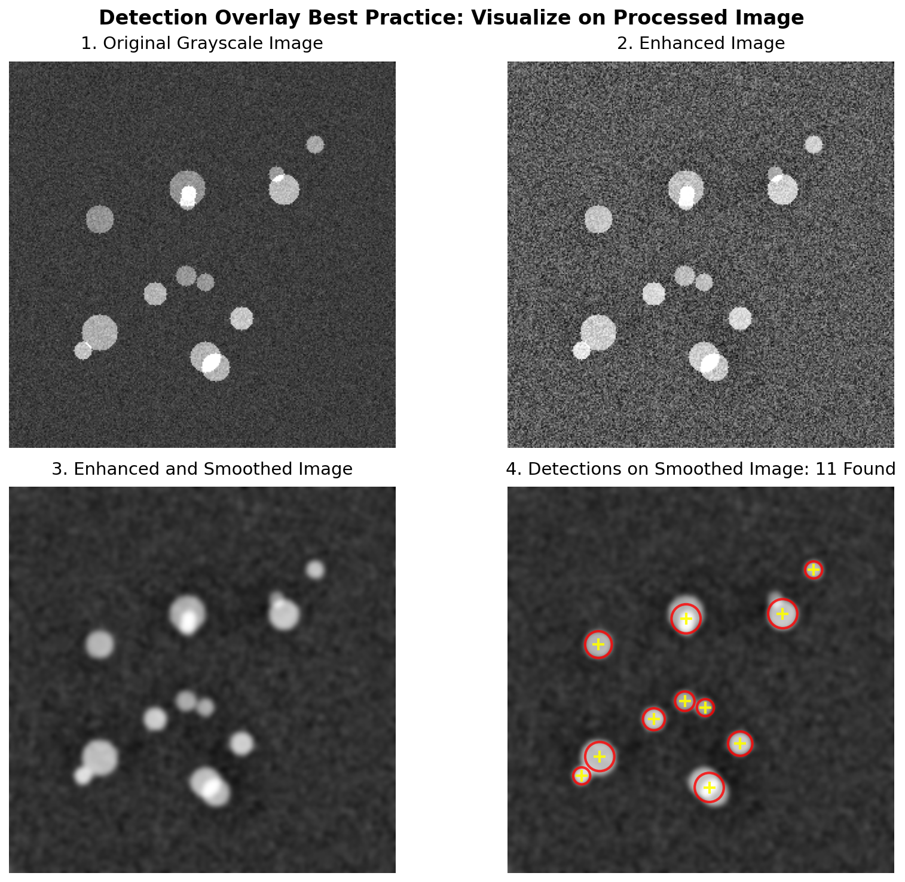

# 🔍 Detection Overlay Visualization: A Computer Vision Best Practice

[](https://www.python.org/downloads/)
[](https://opensource.org/licenses/MIT)
[](https://scikit-image.org/)
[](https://en.wikipedia.org/wiki/Computer_vision)

## 📋 Table of Contents

- [Overview](#overview)
- [The Problem](#the-problem)
- [The Solution](#the-solution)
- [Visual Results](#visual-results)
- [Why This Matters](#why-this-matters)
- [Technical Deep Dive](#technical-deep-dive)
- [Installation](#installation)
- [Usage](#usage)
- [Code Structure](#code-structure)
- [Real-World Applications](#real-world-applications)
- [Common Pitfalls](#common-pitfalls)
- [Contributing](#contributing)
- [References](#references)
- [Citation](#citation)

## 🎯 Overview

This repository demonstrates a **fundamental best practice** in computer vision system development: when visualizing detection results, always overlay them on the **processed image** that was actually used as input to the detection algorithm, not on the original unprocessed image.

### 🔑 Key Insight

> **"Show algorithm outputs on their actual inputs"**

This simple principle can save hours of debugging and prevent misinterpretation of results in production computer vision systems.

## ❓ The Problem

In many computer vision pipelines, images undergo several preprocessing steps before being fed to detection algorithms:

```
Original Image → Enhancement → Filtering → Detection Algorithm → Results
```

A common mistake is to visualize the detection results on the **original image** rather than the **processed image** that the algorithm actually analyzed. This can lead to:

- 🚫 **Misaligned detections** that don't correspond to visible features
- 🚫 **Confusion** about why certain regions were detected
- 🚫 **Difficulty debugging** algorithm behavior
- 🚫 **False conclusions** about algorithm performance

## ✅ The Solution

This repository demonstrates the correct approach through a practical example:

1. **Generate** a synthetic image with defect-like features
2. **Process** the image through enhancement and smoothing
3. **Detect** blob-like features using the processed image
4. **Visualize** results on the same processed image used for detection

## 📊 Visual Results



### Panel Breakdown:

#### Panel 1: Original Grayscale Image
- Raw input with synthetic defects
- Contains noise and varying contrast
- This is what a camera might capture

#### Panel 2: Enhanced Image (CLAHE)
- Contrast Limited Adaptive Histogram Equalization applied
- Local contrast improvements
- Defects become more prominent

#### Panel 3: Enhanced and Smoothed Image
- Gaussian filtering applied after enhancement
- Noise reduction while preserving features
- **This is the actual input to the detection algorithm**

#### Panel 4: Detections on Smoothed Image ✓
- Red circles show detected blob boundaries
- Yellow crosses mark blob centers
- **Critical**: Overlaid on the smoothed image (Panel 3), not the original (Panel 1)

### 🎨 Visual Comparison

| Approach | Visual Result | Debugging Capability | Accuracy |
|----------|--------------|---------------------|-----------|
| ❌ Overlay on Original | Detections appear misaligned | Poor - unclear why detections occurred | Misleading |
| ✅ Overlay on Processed | Detections align with bright regions | Excellent - direct correspondence visible | Accurate |

## 🏭 Why This Matters

### In Production Systems

1. **Quality Control in Manufacturing**
   - Defect detection on semiconductor wafers
   - Surface inspection in automotive parts
   - PCB component verification

2. **Medical Imaging**
   - Tumor detection after image enhancement
   - Cell counting in processed microscopy images
   - Anomaly detection in preprocessed X-rays

3. **Autonomous Systems**
   - Lane detection on preprocessed road images
   - Obstacle detection after noise filtering
   - Feature tracking in enhanced video streams

### During Development

- **Algorithm Debugging**: Immediately see why detections occurred
- **Parameter Tuning**: Understand how preprocessing affects detection
- **Performance Validation**: Verify algorithm behavior visually

## 🔬 Technical Deep Dive

### The Pipeline Architecture

```python
# 1. Image Acquisition
image_gray = load_image()  # Original sensor data

# 2. Enhancement Stage
image_enhanced = equalize_adapthist(image_gray, clip_limit=0.03)
# Purpose: Improve local contrast
# Effect: Makes subtle features more detectable

# 3. Noise Reduction Stage  
image_smoothed = gaussian(image_enhanced, sigma=2.5)
# Purpose: Reduce noise while preserving edges
# Effect: Fewer false detections from noise

# 4. Detection Stage
blobs = blob_log(image_smoothed, threshold=0.08)
# Key: Algorithm sees image_smoothed, NOT image_gray!

# 5. Visualization Stage
display(image_smoothed)  # ✓ Correct background
overlay(blobs)          # Detection results
```

### Mathematical Foundation

The Laplacian of Gaussian (LoG) blob detector used here computes:

```
LoG(x,y,σ) = -1/(πσ⁴)[1 - (x²+y²)/(2σ²)]e^(-(x²+y²)/(2σ²))
```

This operator responds to blob-like structures in `image_smoothed`, not in `image_gray`.

### Processing Effects

| Stage | Purpose | Visual Effect | Impact on Detection |
|-------|---------|--------------|-------------------|
| Original | Raw data | Natural appearance | High noise, low contrast |
| Enhanced | Improve contrast | Brighter features | Better feature separation |
| Smoothed | Reduce noise | Softer appearance | Fewer false positives |

## 🚀 Installation

### Prerequisites

- Python 3.7 or higher
- pip package manager

### Step 1: Clone the Repository

```bash
git clone https://github.com/YOUR_USERNAME/detection-visualization-demo.git
cd detection-visualization-demo
```

### Step 2: Create Virtual Environment (Recommended)

```bash
# Create virtual environment
python -m venv venv

# Activate it
# On Windows:
venv\Scripts\activate
# On macOS/Linux:
source venv/bin/activate
```

### Step 3: Install Dependencies

```bash
pip install -r requirements.txt
```

### Required Packages

```txt
numpy>=1.21.0          # Array operations
matplotlib>=3.4.0      # Visualization
scikit-image>=0.18.0   # Image processing algorithms
scipy>=1.7.0          # Scientific computing
```

## 💻 Usage

### Command Line

```bash
# Run with default settings (saves to images/results.png)
python detection_overlay_demo.py

# Specify custom save path
python detection_overlay_demo.py --save output/my_results.png

# Run without saving
python detection_overlay_demo.py --no-save
```

### In Jupyter Notebook

```python
# Load and run the demo
%run detection_overlay_demo_jupyter.py
run_demo()

# Save to specific location
run_demo(save_path='output/results.png', save=True)
```

### As a Python Module

```python
from detection_overlay_demo import (
    create_synthetic_defect_image,
    process_image_pipeline,
    detect_blobs,
    create_visualization
)

# Generate your own pipeline
image = create_synthetic_defect_image(size=400, num_defects=20)
enhanced, smoothed = process_image_pipeline(image)
blobs = detect_blobs(smoothed)
create_visualization(image, enhanced, smoothed, blobs)
```

## 📁 Code Structure

```
detection-visualization-demo/
│
├── README.md                        # This file
├── requirements.txt                 # Python dependencies
├── .gitignore                      # Git ignore rules
│
├── detection_overlay_demo.py       # Main script (command-line)
├── detection_overlay_demo_jupyter.py # Jupyter-compatible version
├── demo.ipynb                      # Interactive notebook (optional)
│
├── images/
│   └── results.png                 # Generated visualization
│
└── docs/                           # Additional documentation (optional)
    ├── theory.md                   # Theoretical background
    └── examples/                   # More examples
```

### Module Functions

| Function | Purpose | Parameters | Returns |
|----------|---------|------------|---------|
| `create_synthetic_defect_image()` | Generate test data | size, num_defects, seed | numpy array |
| `process_image_pipeline()` | Apply preprocessing | image | enhanced, smoothed |
| `detect_blobs()` | Find blob features | image | blob array |
| `create_visualization()` | Generate 4-panel plot | images, blobs, save_path | None |

## 🌍 Real-World Applications

### 1. Semiconductor Manufacturing
```python
# Wafer defect detection
wafer_image = load_wafer_scan()
enhanced = enhance_contrast(wafer_image)
smoothed = reduce_noise(enhanced)
defects = detect_particles(smoothed)
visualize_on_processed(smoothed, defects)  # ✓ Correct approach
```

### 2. Medical Imaging
```python
# Cell detection in microscopy
cells_image = load_microscopy_image()
preprocessed = preprocess_cells(cells_image)
cell_locations = detect_cells(preprocessed)
show_results(preprocessed, cell_locations)  # ✓ Shows actual detection basis
```

### 3. Autonomous Driving
```python
# Lane detection
road_image = capture_frame()
processed = preprocess_road(road_image)
lanes = detect_lanes(processed)
display_lanes(processed, lanes)  # ✓ Accurate visualization
```

## ⚠️ Common Pitfalls

### 1. The Classic Mistake

```python
# ❌ WRONG: Showing on original
image = load_image()
processed = complex_preprocessing(image)
detections = detect_features(processed)
show_detections(image, detections)  # Misleading!
```

### 2. Pipeline Mismatch

```python
# ❌ WRONG: Different preprocessing for display
image = load_image()
for_detection = preprocess_method_A(image)
for_display = preprocess_method_B(image)
detections = detect(for_detection)
show(for_display, detections)  # Different from what detector saw!
```

### 3. The Correct Approach

```python
# ✓ CORRECT: Consistent visualization
image = load_image()
processed = preprocess(image)
detections = detect(processed)
show_detections(processed, detections)  # Exactly what detector analyzed
```

## 🤝 Contributing

We welcome contributions! Here's how you can help:

1. **Report Issues**: Found a bug or have a suggestion? [Open an issue](https://github.com/YOUR_USERNAME/detection-visualization-demo/issues)

2. **Improve Documentation**: Help others understand better

3. **Add Examples**: Share your use cases

4. **Enhance Code**: Optimize or add features

### Contribution Process

1. Fork the repository
2. Create your feature branch (`git checkout -b feature/AmazingFeature`)
3. Commit your changes (`git commit -m 'Add some AmazingFeature'`)
4. Push to the branch (`git push origin feature/AmazingFeature`)
5. Open a Pull Request

## 📚 References

### Academic Papers

1. Lindeberg, T. (1998). "Feature Detection with Automatic Scale Selection". International Journal of Computer Vision, 30(2), 79-116.

2. Kong, H., Audibert, J. Y., & Ponce, J. (2010). "General Road Detection From a Single Image". IEEE Transactions on Image Processing, 19(8), 2211-2220.

### Books

1. Gonzalez, R. C., & Woods, R. E. (2018). *Digital Image Processing* (4th ed.). Pearson.

2. Szeliski, R. (2010). *Computer Vision: Algorithms and Applications*. Springer.

### Online Resources

- [scikit-image Blob Detection Tutorial](https://scikit-image.org/docs/stable/auto_examples/features_detection/plot_blob.html)
- [OpenCV Image Processing Tutorial](https://docs.opencv.org/4.x/d2/d96/tutorial_py_table_of_contents_imgproc.html)

## 📝 Citation

If you find this demonstration useful in your research or work, please cite:

```bibtex
@misc{detection-overlay-demo,
  author = {Your Name},
  title = {Detection Overlay Visualization: A Computer Vision Best Practice},
  year = {2024},
  publisher = {GitHub},
  url = {https://github.com/YOUR_USERNAME/detection-visualization-demo}
}
```

## 📄 License

This project is licensed under the MIT License - see the [LICENSE](LICENSE) file for details.

---

<div align="center">

**Remember: Always visualize algorithm outputs on their actual inputs!**

Made with ❤️ for the Computer Vision Community

[⬆ Back to Top](#-detection-overlay-visualization-a-computer-vision-best-practice)

</div>
